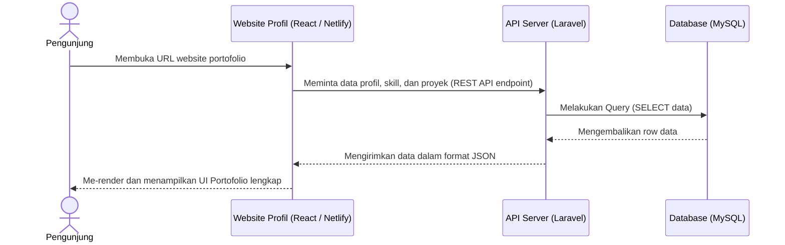
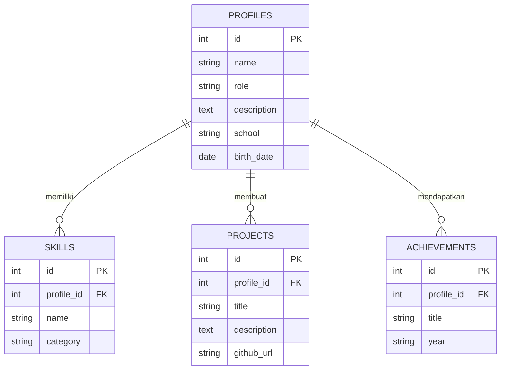

# PRD — Project Requirements Document

## 1. Overview
Kebutuhan standar seperti CV (Curriculum Vitae) dalam format dokumen seringkali kurang efektif bagi seorang *Software Engineer* untuk menunjukkan kemampuannya secara nyata. Proyek ini bertujuan untuk membangun sebuah website portofolio pribadi interaktif untuk **Bima Satria Putra** (Junior Software Engineer, 16 tahun, siswa kelas 10 jurusan RPL di SMK Negeri 1 Surabaya). 

Aplikasi ini dirancang untuk menyelesaikan masalah pembuktian keahlian (showcase) dengan memberikan wadah digital yang profesional. Website ini akan menampilkan profil, puluhan keahlian teknis yang dikuasai, prestasi, hingga tautan langsung ke repositori GitHub. Tujuan utamanya adalah menciptakan "Kesan Pertama yang Kuat" (pengunjung langsung melihat nama dan gelar Bima) sekaligus mengundang pengunjung untuk kembali di lain waktu guna melihat pembaruan keahlian (*skill*) dan proyek terbarunya.

## 2. Requirements
- **Fungsi Utama:** Sistem harus mampu menampilkan halaman profil publik yang dapat diakses siapa saja, memuat data diri, pendidikan, daftar keahlian, dan portofolio proyek.
- **Dinamis:** Sistem harus memiliki *backend* agar pemilik website (Bima) dapat menambah, mengubah, atau menghapus data keahlian dan proyek secara berkala tanpa harus mengubah kode (berkaitan dengan tujuan pengunjung yang ingin "melihat skill baru").
- **Tampilan (UI/UX):** Harus modern, responsif (tampil baik di HP maupun Laptop), dan merepresentasikan identitas seorang "Programmer".
- **Performa:** Waktu muat (load time) harus cepat untuk memastikan pengunjung tidak meninggalkan halaman sebelum profil penuh dimuat.

## 3. Core Features
- **Hero Section (First Win):** Bagian paling atas yang langsung menampilkan nama "Bima Satria Putra" dan perannya sebagai "Junior Software Engineer", memberikan kepuasan instan saat website dibuka.
- **Tentang Saya (About Me):** Menampilkan rangkuman identitas Bima, termasuk umur, tanggal lahir, dan latar belakang pendidikan (SMK Negeri 1 Surabaya, Jurusan Rekayasa Perangkat Lunak).
- **Etalase Keahlian (Skill Showcase):** Menampilkan daftar rapi dari teknologi yang dikuasai secara visual (Python, JavaScript, React, Laravel, Node.js, dll). Fitur ini dibuat agar pengunjung selalu tertarik untuk kembali dan melihat *skill* apalagi yang baru dipelajari Bima.
- **Portofolio & Repositori (GitHub Link):** Daftar proyek yang pernah dikerjakan beserta deskripsi singkat dan tombol yang mengarah langsung ke repositori GitHub.
- **Daftar Prestasi (Achievements):** Bagian yang menyoroti pencapaian atau sertifikasi yang berhasil diraih Bima sejauh ini.

## 4. User Flow
1. **Pendaratan (Landing) & Kesan Pertama:** Pengunjung (misalnya perekrut atau teman) membuka tautan website. Mereka langsung disambut oleh sapaan, nama lengkap Bima, dan gelarnya sebagai Programmer.
2. **Eksplorasi Profil:** Pengunjung menggulir layar ke bawah (*scroll*) dan membaca bagian deskripsi diri serta latar belakang SMK Bima.
3. **Validasi Kemampuan:** Pengunjung melanjutkan *scroll* ke bagian Keahlian (*Skills*) dan melihat daftar panjang teknologi (*tech stack*) yang Bima kuasai.
4. **Pembuktian Proyek (Action):** Pengunjung melihat daftar proyek dan prestasi. Jika mereka tertarik dengan salah satu proyek, mereka mengeklik tautan yang akan membuka tab baru menuju repositori GitHub Bima untuk melihat kode aslinya.

## 5. Architecture
Aplikasi ini beroperasi menggunakan arsitektur *Client-Server API Base*. Bagian Frontend (React) yang bertugas menangani UI akan di-*host* (disebarkan) melalui Netlify. Ketika pengunjung membuka website, React akan mengirimkan permintaan (HTTP Request) ke Backend (Laravel API) yang berada di server terpisah. Laravel kemudian mengambil data dari Database (MySQL) dan mengirimkannya kembali ke Frontend.

Berikut adalah diagram alur kerjanya:

## 6. Database Schema
Untuk membuat data menjadi dinamis, kita memerlukan basis data yang menyimpan struktur profil, keahlian, dan proyek. Berikut adalah tabel utama yang dibutuhkan:

1. **Table `profiles`**
   - `id` (Primary Key, Int): ID Unik profil.
   - `name` (String): Nama lengkap (Bima Satria Putra).
   - `role` (String): Jabatan atau gelar (Junior Software Engineer).
   - `description` (Text): Teks deskripsi diri.
   - `school` (String): Nama instansi sekolah.
   - `birth_date` (Date): Tanggal lahir untuk perhitungan umur.
2. **Table `skills`**
   - `id` (Primary Key, Int): ID unik keahlian.
   - `name` (String): Nama keahlian (contoh: React, Laravel, Python).
   - `category` (String): Kategori (contoh: Frontend, Backend, Tools).
3. **Table `projects`**
   - `id` (Primary Key, Int): ID unik proyek.
   - `title` (String): Nama proyek.
   - `description` (Text): Penjelasan singkat tentang fitur proyek.
   - `github_url` (String): Tautan menuju repositori GitHub.
4. **Table `achievements`**
   - `id` (Primary Key, Int): ID unik prestasi.
   - `title` (String): Nama prestasi atau sertifikat.
   - `year` (String): Tahun pencapaian.

**Entity Relationship Diagram (ERD):**

## 7. Tech Stack
Berikut adalah teknologi yang direkomendasikan dan disesuaikan dengan permintaan serta keahlian pengguna:

- **Frontend:** **React.js** (Sangat disarankan menggunakan *Vite* sebagai *bundler* yang juga dikuasai oleh Bima, untuk performa *development* yang cepat).
- **Backend:** **Laravel (PHP)** (Akan difungsikan murni sebagai *headless REST API* yang menyajikan data dalam format JSON untuk dikonsumsi Frontend).
- **Database:** **MySQL** (Relational Database Management System yang terhubung melalui standard bawaan Laravel Eloquent ORM).
- **Deployment:** 
  - **Netlify:** Digunakan khusus untuk men-deploy aplikasi Frontend (React.js) yang menayangkan antarmuka pengguna secara statis/SPA.
  - *(Catatan tambahan logistik)*: Backend Laravel dan MySQL konvensionalnya tidak dapat di-*deploy* langsung di Netlify. Keduanya harus diletakkan di server terpisah, seperti VPS, layanan cPanel, atau *cloud hosting* seperti Railway / Heroku agar dapat diakses oleh aplikasi UI di Netlify.